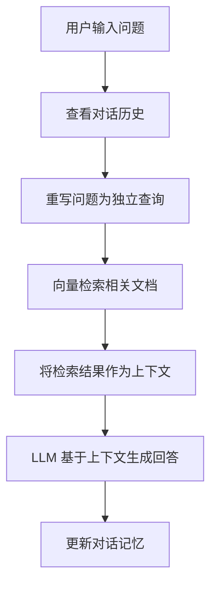
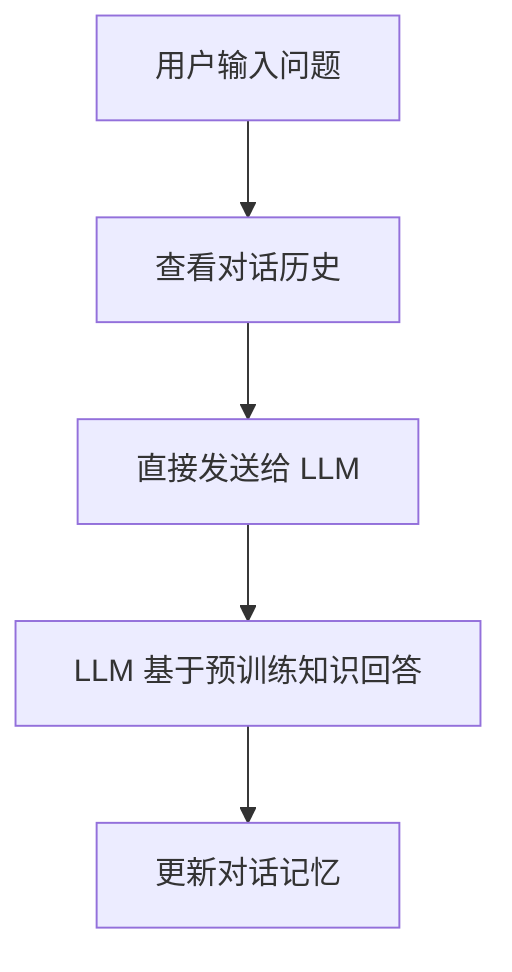

# LlamaIndex 聊天引擎模式对比：condense_question vs SimpleChatEngine

## 概述

在 LlamaIndex 中，有两种主要的聊天模式来处理用户对话：
1. **condense_question 模式** - 基于检索增强生成（RAG）的聊天引擎
2. **SimpleChatEngine** - 直接与 LLM 对话的简单聊天引擎

本文档详细分析这两种模式的区别、工作原理和适用场景。

## 核心区别对比

| 特性 | condense_question 模式 | SimpleChatEngine 模式 |
|------|----------------------|---------------------|
| **数据检索** | ✅ 会检索向量索引中的相关文档 | ❌ 不进行任何数据检索 |
| **知识来源** | 📚 基于索引的知识库 + LLM 的预训练知识 | 🧠 仅使用 LLM 的预训练知识 |
| **对话记忆** | ✅ 支持（通过共享 memory） | ✅ 支持（通过共享 memory） |
| **响应准确性** | 🎯 对特定领域问题更准确 | 🌐 通用性强但可能不够专业 |
| **处理速度** | 🐌 较慢（需要检索步骤） | ⚡ 较快（直接 LLM 推理） |
| **成本** | 💰 较高（检索 + 生成） | 💸 较低（仅生成） |

## 详细工作原理

### 1. condense_question 模式

#### 工作流程：


#### 核心特点：
- **问题重写**：将用户的当前问题结合对话历史，重写为一个独立的、包含完整上下文的查询
- **向量检索**：使用重写后的问题在向量索引中检索最相关的文档片段
- **上下文增强**：将检索到的文档作为上下文提供给 LLM
- **知识融合**：结合检索到的专业知识和 LLM 的通用知识生成回答

#### 代码示例：
```python
# 创建 condense_question 引擎
condense_engine = index.as_chat_engine(
    chat_mode="condense_question",
    memory=memory,
    verbose=True
)

# 使用时会自动进行检索
response = condense_engine.chat("Python 中如何定义函数？")
```

### 2. SimpleChatEngine 模式

#### 工作流程：


#### 核心特点：
- **直接对话**：不进行任何文档检索，直接与 LLM 对话
- **通用知识**：仅依赖 LLM 的预训练知识
- **快速响应**：没有检索步骤，响应速度更快
- **灵活性强**：适合处理各种通用性问题和闲聊

#### 代码示例：
```python
# 创建 SimpleChatEngine
simple_engine = SimpleChatEngine.from_defaults(
    llm=Settings.llm,
    memory=memory,
    system_prompt="你是一个友好的对话助手。请简洁、清晰、有条理地回应，并用一点点 emoji。",
    verbose=True
)

# 直接与 LLM 对话，不检索知识库
response = simple_engine.chat("把刚才的要点用 3 条列一下")
```

## 共享记忆机制

两种模式都可以共享同一个 `ChatSummaryMemoryBuffer`，这意味着：

- ✅ **对话连续性**：在两种模式之间切换时，对话历史得以保持
- ✅ **上下文理解**：后续对话可以引用之前的内容
- ✅ **智能摘要**：当对话过长时，自动进行摘要以节省 token

```python
# 共享的记忆缓冲区
memory = ChatSummaryMemoryBuffer.from_defaults(
    token_limit=1000,
    llm=Settings.llm
)

# 两个引擎共享同一个 memory
condense_engine = index.as_chat_engine(chat_mode="condense_question", memory=memory)
simple_engine = SimpleChatEngine.from_defaults(llm=Settings.llm, memory=memory)
```

## 适用场景分析

### condense_question 模式适用于：

1. **专业知识问答** 📚
   - 需要基于特定文档或知识库回答问题
   - 要求高准确性和专业性的场景
   - 例如：技术文档查询、学术资料问答

2. **事实性查询** 🔍
   - 需要引用具体的数据或文档内容
   - 要求可追溯信息来源
   - 例如：政策解读、产品说明

3. **领域专家系统** 🎯
   - 构建特定领域的智能助手
   - 需要结合最新的专业资料
   - 例如：医疗咨询、法律顾问

### SimpleChatEngine 模式适用于：

1. **通用对话** 💬
   - 日常闲聊和一般性问题
   - 不需要特定知识库支持的场景
   - 例如：问候、感谢、简单建议

2. **创意生成** ✨
   - 需要 LLM 发挥创造性的任务
   - 不依赖特定文档的内容生成
   - 例如：写诗、编故事、头脑风暴

3. **对话管理** 🎭
   - 澄清用户意图
   - 引导对话流程
   - 例如：确认需求、总结要点

## 最佳实践建议

### 1. 混合使用策略 🔄

```python
# 示例：智能路由策略
def choose_engine(user_question, context):
    if is_knowledge_query(user_question):
        return condense_engine.chat(user_question)
    else:
        return simple_engine.chat(user_question)
```

### 2. 性能优化 ⚡

- **condense_question 模式**：
  - 优化检索参数（top_k, similarity_threshold）
  - 使用高效的向量存储（如 Qdrant）
  - 合理设置 chunk 大小

- **SimpleChatEngine 模式**：
  - 精心设计 system_prompt
  - 控制对话历史长度
  - 使用流式响应提升用户体验

### 3. 记忆管理 🧠

```python
# 定期清理记忆以避免 token 超限
if memory.token_count > 2000:
    memory.reset()
    # 或者使用摘要功能
    memory.summarize()
```

## 总结

- **condense_question 模式**：专业、准确、基于知识库，适合需要专业知识支持的场景
- **SimpleChatEngine 模式**：快速、灵活、通用性强，适合一般对话和创意任务

在实际应用中，建议根据用户问题的性质智能选择合适的模式，或者将两者结合使用，以提供最佳的用户体验。通过共享记忆机制，可以在保持对话连续性的同时，充分发挥两种模式的各自优势。
